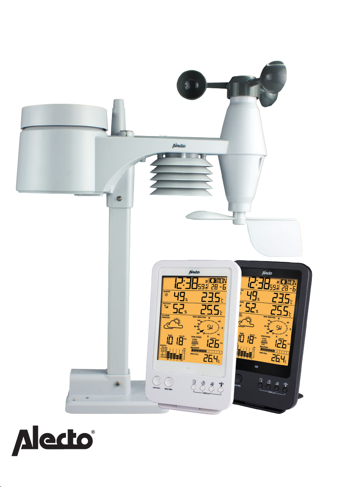
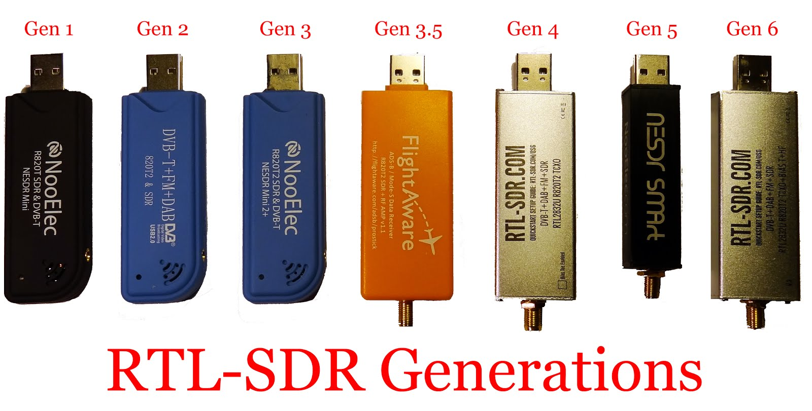

# Super-Weather
Make your analog weatherstation digital! It currently converts sniffs the radio signal between an Alecto WS-4800 (also known as Bresser 5-in-1) device and its display.The received data is then being send to:
- the [English MetOffice](https://wow.metoffice.gov.uk/);
- the [Dutch KNMI](https://wow.knmi.nl/);
- [IBM's Weather.com](https://support.weather.com/s/article/PWS-Upload-Protocol?language=en_US);
- [AerisWeather](https://www.pwsweather.com/aerisweather);
- [OpenWeathermap](https://openweathermap.org);
- [Windy](https://windy.com);
- Your own [Ntfy.sh](https://ntfy.sh/) instance, to receive weatherreports on your mobile phone;
- Your own PostGreSQL database (for storing addtional details such as: heat index, wind chill, dewpoint, cloud base).

## What it requires?
- A Alecto WS-4800/Bresser 5-in-1 (the underlying RTL_433 driver support many devices, you just have to find the right configuration number for your device and tweak the mapping);

- A RTL-SDR[https://www.rtl-sdr.com/buy-rtl-sdr-dvb-t-dongles/] USB receiver with a 433MHz or 833MHz antenna (depending on your weatherstation);

- A small computer. Some examples: Raspberry Pi, Raspberry Pi Zero W.

## Installation:
1. Download and extract the latest release;
2. On Debian based distro's run: Install.sh. On other operatignsystems install Python 3 and run: pip install -r requirements.txt;
3. Copy the configuration template 'config-example.ini' to 'config.ini';
4. Edit the configuration file.
5. Run in a terminal/commandshell: python handler.py

Please note: The database is required. The PostgreSQL user needs to be able to add new tables within a database. The script will install them for you.
